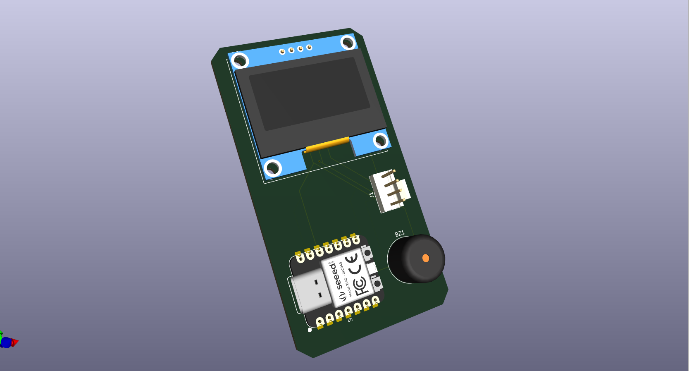

# Hot Hermes 🌡️

a mini temperature sensor + display for environment and room temperatures, with a buzzer that warns me when it gets above 34°C so i dont burn my food while cooking lol.

## Why i made this

i cook a lot and my kitchen gets HOT. i wanted something small that could just sit there, show me the temperature, and scream at me (well, buzz loudly) when things get too warm. also i wanted to finally learn how I2C works and this was the perfect excuse.

## How it works

- **AHT20 module** reads the temperature and humidity over I2C
- **1.3" OLED** displays the readings in real time
- **Passive buzzer** goes off when temp hits above 34°C
- everything runs on the **XIAO RP2040**

## Screenshots

> 

## BOM

| Item # | Designator | Description | Qty | Unit Price (USD) | Total + Shipping (USD) | Source | Link |
|--------|------------|-------------|-----|-----------------|----------------------|--------|------|
| 1 | U1 | Seeed XIAO RP2040 Microcontroller | 1 | $4.86 | $9.19 | AliExpress | [link](https://www.aliexpress.com/item/1005006593701624.html?spm=a2g0o.cart.0.0.742b38daUU8kz0&mp=1&pdp_npi=6%40dis%21USD%21USD+6.31%21USD+4.61%21%21USD+4.61%21%21%21%40211b876717768556104776423e1131%2112000039072595754%21ct%21NG%216438462769%21%211%210%21&pdp_ext_f=%7B%22cart2PdpParams%22%3A%7B%22pdpBusinessMode%22%3A%22retail%22%7D%7D) |
| 2 | DS1 | 1.3" I2C OLED Display Module 128x64 (Blue) | 1 | $3.89 | $4.89 | AliExpress | [link](https://www.aliexpress.com/item/1005010183965559.html?spm=a2g0o.cart.0.0.742b38daUU8kz0&mp=1&pdp_npi=6%40dis%21USD%21USD+8.28%21USD+3.89%21%21USD+3.85%21%21%21%40211b876717768556104776423e1131%2112000051437252682%21ct%21NG%216438462769%21%211%210%21) |
| 3 | U2 | AHT20 Temperature & Humidity Sensor Module | 1 | $2.16 | $2.10 | AliExpress | [link](https://www.aliexpress.com/item/1005006088708984.html?spm=a2g0o.cart.0.0.742b38daUU8kz0&mp=1&pdp_npi=6%40dis%21USD%21USD+2.16%21USD+2.16%21%21USD+2.12%21%21%21%40211b876717768556104776423e1131%2112000035679578526%21ct%21NG%216438462769%21%211%210%21) |
| 4 | J1 | 2.54mm 4-Pin Header (JST/DuPont) | 1 | $0.88 | $0.88 | AliExpress | [link](https://www.aliexpress.com/item/1005009214801411.html?spm=a2g0o.cart.0.0.742b38daUU8kz0&mp=1&pdp_npi=6%40dis%21USD%21USD%201.76%21USD%200.88%21%21USD%200.88%21%21%21%40211b876717768556104776423e1131%2112000048338655484%21ct%21NG%216438462769%21%211%210%21) |
| 5 | PCB | hermes_Y5 Custom PCB — 5pcs, JLCPCB | 1 | $4.00 | $9.49 | JLCPCB | [link](https://jlcpcb.com) |
| | | | | **TOTAL** | **$26.55** | | |